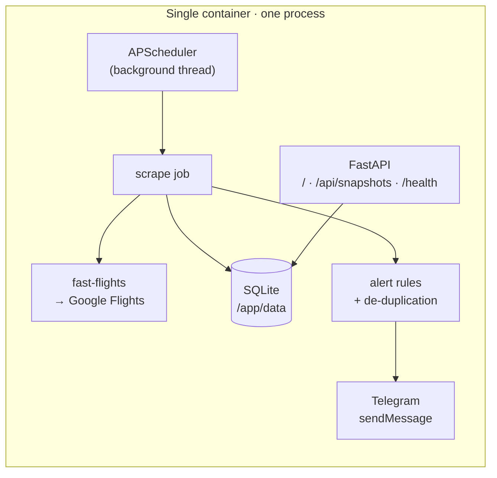

# fare-watch

**A self-hosted flight price tracker in a single container.** It checks a route on a
schedule, stores every price it sees, alerts you on Telegram when something worth
knowing happens, and serves a dashboard of the price history.

Airlines move fares constantly and the "set a price alert" buttons on booking sites
are a black box: you don't see the history, you don't control the thresholds, and
you can't tell whether today's price is actually good. fare-watch keeps the whole
series in a SQLite file you own, and colors every data point with Google's own
low / typical / high assessment so a price has context instead of just a number.

| | |
|---|---|
| **Stack** | Python 3.12 · FastAPI · SQLite · APScheduler · Docker |
| **Data source** | [`fast-flights`](https://github.com/AWeirdDev/fast-flights) v3 — Google Flights, no API key, no paid tier |
| **Configuration** | Environment variables only — nothing route-specific ever lands in the repo |
| **Footprint** | One container, one process, one `.db` file |

---

## Features

- **Scheduled scraping** at any times you choose, in your own timezone.
- **Five alert rules** — price floor, price ceiling, percentage swing vs. the previous
  check, reminders on specific dates, and a final message on your buy-by deadline.
- **De-duplicated alerts.** The same alert never fires twice in a row, so a price that
  sits below your floor for a week doesn't produce fourteen notifications.
- **Self-monitoring.** Two consecutive failed or empty scrapes trigger a failure alert,
  and a recovery message follows once it works again. Raw responses are saved for
  debugging.
- **Price-history dashboard** with floor/ceiling reference lines, markers on reminder
  and deadline dates, and points colored by Google's price level. Dark mode included.
- **No secrets in the repo.** Every route, date, amount and token comes from the
  environment; the app validates all of it at startup and refuses to run if anything
  is missing or malformed.

## How it works



Every run: fetch the cheapest fare for the route, store a snapshot, compare it against
the previous one and against your thresholds, then send whatever alerts survive
de-duplication. Calendar alerts (reminders, deadline) are evaluated in the same pass,
using the current date in your configured timezone.

The scheduler lives inside the FastAPI process rather than in a separate cron
container, which keeps the deployment to a single service and lets the dashboard and
the job share one SQLite connection policy.

## Quick start

```bash
cp .env.example .env      # fill in your values — .env is git-ignored
docker compose up -d --build
open http://localhost:8000/
```

Force a scrape instead of waiting for the next scheduled slot:

```bash
docker compose exec fare-watch python -m app.run_once
```

## Configuration

Everything is validated at startup. If something is wrong, the app exits and prints
every problem at once, rather than failing on the first one:

```
CRITICAL fare_watch: Invalid configuration:
  - ORIGIN=AA1 must be a 3-letter IATA code
  - SCRAPE_TIMES entry '25:00' is not a valid HH:MM time
  - TELEGRAM_CHAT_ID is required but not set
```

### Required

| Variable | Example | Notes |
|---|---|---|
| `ORIGIN` | `AAA` | IATA code |
| `DESTINATION` | `BBB` | IATA code |
| `DEPART_DATE` | `2099-01-01` | `YYYY-MM-DD` |
| `RETURN_DATE` | `2099-01-15` | Must be defined; **empty = one-way** |
| `TELEGRAM_BOT_TOKEN` | `123456:ABC…` | From BotFather (see below) |
| `TELEGRAM_CHAT_ID` | `123456789` | See below |

### Optional

| Variable | Default | Notes |
|---|---|---|
| `PASSENGERS` | `1` | Adults, 1–9 |
| `CABIN_CLASS` | `economy` | `economy`, `premium-economy`, `business`, `first` |
| `CURRENCY` | `USD` | ISO 4217 |
| `PRICE_FLOOR` | *(empty)* | Alert when the price drops **below** this. Empty disables it |
| `PRICE_CEILING` | *(empty)* | Alert when the price rises **above** this. Empty disables it |
| `CHANGE_THRESHOLD_PCT` | `5` | Alert when the price moves **more than** this % vs. the previous snapshot |
| `REMINDER_DATES` | *(empty)* | Comma-separated dates, e.g. `2099-01-01,2099-01-08` |
| `DEADLINE_DATE` | *(empty)* | Final "buy now" message on that date. Empty disables it |
| `SCRAPE_TIMES` | `09:00,21:00` | Local times (per `TZ`), comma-separated `HH:MM` |
| `TZ` | `UTC` | IANA name, e.g. `Europe/Madrid` |
| `DASHBOARD_TOKEN` | *(empty)* | If set, `/` and `/api/snapshots` require `?token=<value>` and return 403 otherwise |
| `LOG_LEVEL` | `INFO` | |
| `DATA_DIR` | `/app/data` | Where the SQLite file lives; only change it for local development |

## Telegram setup

### 1. Create the bot

1. Open a chat with **[@BotFather](https://t.me/BotFather)**.
2. Send `/newbot`, pick a display name and a username ending in `bot`.
3. BotFather replies with a token like `123456789:AAH…` — that's `TELEGRAM_BOT_TOKEN`.
   Treat it like a password.

### 2. Find your chat id

1. Send your new bot any message (`hi` will do). Bots cannot message you first.
2. Open this URL in a browser, with your token substituted in:

   ```
   https://api.telegram.org/bot<TELEGRAM_BOT_TOKEN>/getUpdates
   ```

3. Look for `"chat":{"id": 123456789, …}` — that number is `TELEGRAM_CHAT_ID`.
   For a group, add the bot to the group, post a message there, and use the group's
   id (it is negative, e.g. `-1001234567890`). If `result` is empty, send another
   message and reload.

Verify end to end:

```bash
curl -s -X POST "https://api.telegram.org/bot<TOKEN>/sendMessage" \
     -d chat_id=<CHAT_ID> -d text="fare-watch test"
```

## Alerts

Delivered with Telegram's `sendMessage` over HTTP POST — no webhook, no inbound
traffic, nothing to expose.

| Trigger | Repeats? |
|---|---|
| Price < `PRICE_FLOOR` | Not while the price stays the same; again if it changes while still below |
| Price > `PRICE_CEILING` | Same |
| \|change\| > `CHANGE_THRESHOLD_PCT` vs. the previous snapshot | Once per snapshot |
| Today is in `REMINDER_DATES` | Once per date |
| Today is `DEADLINE_DATE` | Once |
| Two consecutive failed or empty scrapes | Once per outage, plus a recovery message afterwards |

Sent alerts are recorded in an `alerts_sent` table, which is what makes
de-duplication survive restarts. If Telegram is unreachable the alert is *not*
recorded, so the next run retries it.

## Dashboard and endpoints

| Route | Auth | Purpose |
|---|---|---|
| `GET /` | `DASHBOARD_TOKEN` if set | Price history chart + summary tiles + snapshot table |
| `GET /api/snapshots` | `DASHBOARD_TOKEN` if set | Raw snapshots as JSON |
| `GET /health` | always open | `{"status": "ok\|degraded\|failing\|starting", "last_success_at": "…"}` |

The chart plots every snapshot, draws dashed reference lines at your floor and
ceiling, marks reminder and deadline dates, and colors each point by Google's price
level (green = low, gray = typical, red = high, hollow = unknown). The header tiles
show the current price, the historical minimum and maximum, and the days left until
the deadline. Chart.js is loaded from a CDN, pinned with subresource integrity —
no npm, no build step, one HTML template.

`/health` is deliberately thin: it reports liveness and the timestamp of the last
successful scrape, and never leaks the route, the dates or any price. It is also
what Docker's `HEALTHCHECK` calls, and it returns 200 even while scraping is failing
so that a Google-side outage doesn't cause a restart loop.

> **If you expose port 8000, set `DASHBOARD_TOKEN`.** Left empty, the dashboard is
> public and so is your route. Generate one with `openssl rand -hex 24` and bookmark
> `https://your-host/?token=<value>`.

## Engineering notes

A few decisions that took more than the obvious approach:

**Recovering Google's price level.** fast-flights v3 dropped the `current_price`
field that v2 exposed, so the low/typical/high signal had to be recovered elsewhere.
fare-watch reuses the HTML that `get_flights()` already fetches — via a custom
`FetchIntegration` that keeps the response — and reads Google's "Prices are currently
…" indicator, falling back to comparing the fare against the typical range embedded
in the page data. The field is nullable, because for some routes Google shows no
assessment at all.

**Treating scraper breakage as a first-class state.** Unofficial scrapers fail
quietly: Google changes its fingerprinting and results come back empty rather than
erroring. Every run is recorded in a `scrape_runs` table, empty and malformed results
count as failures, two in a row notify you, and the raw response is written to
`data/raw_responses/` (last 10 kept) so the breakage can actually be diagnosed.

**Money as `Decimal`, stored as text.** Prices never touch a float, and SQLite holds
them as `TEXT` to avoid the rounding drift that would otherwise show up in
percentage-change comparisons.

**Alert rules as pure functions.** `evaluate_price()` and `evaluate_calendar()` take
settings and snapshots and return a list of alerts; sending and recording happen
separately. That is what makes the threshold and de-duplication behavior testable
without a network or a scheduler.

## Development

```bash
python3.12 -m venv .venv && . .venv/bin/activate
pip install -r requirements-dev.txt
pytest

# run locally (DATA_DIR keeps the database out of /app/data)
set -a; . ./.env; set +a
DATA_DIR=./data uvicorn app.main:app --reload
```

The test suite covers configuration parsing and rejection, every alert rule and its
de-duplication, the failure-streak and recovery logic, and the HTTP endpoints
including the token gate and the fact that `/health` leaks nothing.

### Layout

```
app/
  config.py      env parsing & validation (Settings)
  scraper.py     fast-flights query, price-level extraction, raw-response dumps
  db.py          SQLite: snapshots, alerts_sent, scrape_runs
  alerts.py      alert rules + de-duplication
  telegram.py    sendMessage client
  jobs.py        scheduled job & APScheduler wiring
  main.py        FastAPI app: / · /api/snapshots · /health
  run_once.py    manual one-off scrape
  templates/index.html
tests/
```

## Deploying on Coolify

1. **New Resource → Docker Compose**, pointed at your fork.
2. Add the environment variables. Coolify picks them up from `docker-compose.yml`;
   the required ones are marked with `:?` and will block the deploy if unset.
3. The named volume `fare-watch-data` is mounted at `/app/data`, so the database
   survives redeploys.
4. Assign a domain to the service on port `8000` and set `DASHBOARD_TOKEN`.
5. **Keep a single replica.** The scheduler runs inside the web process, so two
   replicas would scrape and alert twice.

## Limitations

- Scraping Google Flights is unofficial and can break without warning. Pin
  `fast-flights` and upgrade it deliberately.
- One route per instance, by design. Run a second container for a second route.
- Prices are what Google shows for the cheapest itinerary matching your query; they
  are a tracking signal, not a quote.
- fast-flights 3.1.0 imports `typing_extensions` without declaring it as a
  dependency, so `requirements.txt` pins it explicitly.
